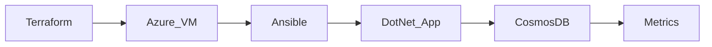
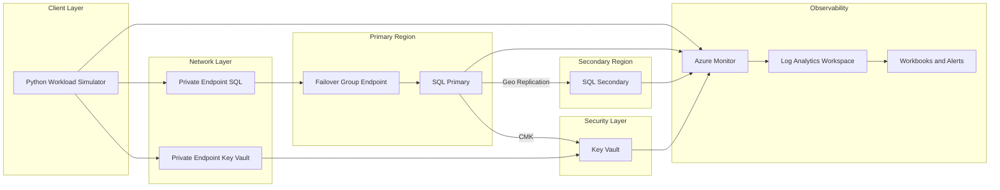

# Hello, I’m Emmanuel 

**On Prem & Cloud Database Administrator** with proven experience supporting mission-critical **SQL Server and Oracle** systems in a top-tier Nigerian bank, across  on-prem and Azure environments.I build and maintain the systems that keep data running—secure, available, and efficient. By combining cloud, infrastructure, and automation, I help ensure everything works reliably behind the scenes.

## 🚀 Featured Database Engineering Projects

### 1. Cosmos DB Batch Ingestion Demo

Built a practical test environment to understand how Azure Cosmos DB handles high-volume data ingestion and how to optimize performance and cost.

This project simulates real-world scenarios where large amounts of data need to be written efficiently, helping identify how throughput (RU/s) and system behavior change under load.

#### What I Focused On

- Monitoring how request units (RU) are consumed during heavy data ingestion  
- Testing batch ingestion patterns to improve performance and reduce cost  
- Using Terraform to provision infrastructure in a consistent and repeatable way  
- Using Ansible to configure virtual machines and standardize the environment 

#### Repository

→ [View CosmosDB Project](https://github.com/hardeymolhar/azure-data-platform)
---

#### 🏗 System Architecture

### 2. Secure Azure SQL PaaS with Cross-Region High Availability (In Progress)

Designed a secure and highly available Azure SQL environment to address common risks in banking and fintech systems, including downtime, data loss, and public exposure.

This project focuses on building a reliable database platform that can continue operating during failures while keeping data secure and accessible.

#### What I Focused On

- Designing for high availability using cross-region failover and data replication  
-  Using Terraform to provision infrastructure in a consistent and repeatable way   
- Securing database access using private endpoints instead of public exposure  
- Implementing encryption using customer-managed keys stored in Azure Key Vault  
- Choosing controlled connectivity (proxy mode) to align with strict enterprise network environments  

#### Repository

→ [View Azure SQL Project](https://github.com/hardeymolhar/azure-sql-automated-infrastructure)
---

## 🏗️ System Architecture

## 🧰 Tech Stack

Databases & DBA Tools

Cloud, OS & Automation

