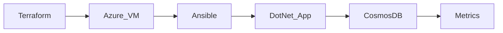

# Hello, I’m Emmanuel 

**Cloud Database Engineer** with hands-on experience administering **SQL Server and Oracle workloads on-prem** while designing and deploying Azure infrastructure for database platforms.
My focus is building and operating systems where **databases, networking, compute, and automation intersect**.

## 🚀 Featured Engineering Projects

### 1. Cosmos DB Batch Ingestion Demo
High-throughput ingestion testing using the Azure Cosmos DB .NET SDK deployed on infrastructure provisioned with Terraform and configured with Ansible.

#### Engineering Focus

- Cosmos DB RU consumption monitoring
- Batch ingestion performance testing
- Infrastructure provisioning with Terraform
- VM configuration using Ansible

🔗 Repository
→ [View CosmosDB Project](https://github.com/hardeymolhar/azure-data-platform)

#### 🏗 System Architecture

---

## 🧰 Tech Stack

Databases & DBA Tools

Cloud, OS & Automation

